# ShipCheck AI


🌐 **Live Demo**: [https://shipcheck-ai.onrender.com](https://shipcheck-ai.onrender.com)  (it may takes few minutes to be fully ready, please wait patiently)
🎥 **5-Minute Video Pitch**: [Watch Demo Video](https://drive.google.com/file/d/19nWLSXbLaniAlkYJrzfJQwVASSQOsi9C/view?usp=drive_link)
🏆 **Averis × Monash Hackathon 2026**: Shipping Document Verification Use Case  
👥 **Team**: [T4F, MEMBERS= YEOH ZHENG DA & NG WEI JER]

**From a shared shipping inbox to a discrepancy report, with a person in the loop.**

ShipCheck AI reads every email in a shipping-operations inbox and decides what it is: a draft-BL check, a new SI request, an invoice query, a general update or spam. For each check request it reads the attached **Shipping Instruction (SI)** and **draft Bill of Lading (BL)** in TXT, PDF, Word or Excel format. It lines up fields that are labelled differently ("Port of Loading" = "Load Port" = "POL") and compares the seven shipment fields. The report shows the SI and BL values side by side.

When the system cannot decide safely, it hands the case to a person with the evidence and the reason. Examples: a scanned or corrupt file, a missing or wrong attachment, or a blank value. The reviewer confirms or corrects the values, and the report is recalculated and logged.

Built for the **Averis × Monash Hackathon 2026: Shipping Document Verification** use case.

---

## Results on the provided dataset (520 emails)

Scored with the organisers' self-evaluation (`POST /submit` / `score_cli.py`):

| Metric | Score |
|---|---|
| Stage 1: email classification, macro-F1 | **1.000** (520/520) |
| Stage 3: SI-vs-BL defect precision / recall / field-F1 | **1.000 / 1.000 / 1.000** |
| End-to-end: defects caught with the exact fields | **46/46** |
| Reliability: escalation precision / recall | **1.000 / 1.000** (20/20, correct reason each time) |
| **Final score** | **1.0000** |

The engine never sees the answer key. The results above come from general rules plus the checks in `tests/`. Those 41 tests use synthetic messy inputs that are **not** in the dataset: EU number formats, MT units, `2 x 40'HC + 1 x 20'GP`, port aliases, swapped file names, Word tables, corrupt PDFs and placeholder values.

---

## What it does

| Capability | How |
|---|---|
| **Classify** | An explainable weighted-signal classifier reads the *newest* message body. It strips external-sender banners, quoted threads and signatures, because subjects such as `RE_ TO CONFIRM DOCS` are recycled and misleading. It also looks at what is attached. Each decision comes with a confidence score and the signals that fired. The **AI model (Gemini free tier, or Claude)** decides whenever confidence is below 0.75. |
| **Extract** | Parsers for TXT, PDF (character-level, splitting bold labels from values so overflowing labels don't mix with values), DOCX (tables in body order) and XLSX. A label lexicon of about 60 variants, including bilingual `PORT OF LOADING (装货港)`, aligns fields by meaning. Net weight and per-container rows are never taken as the gross total. When a label is not recognised, the **AI model** finds the field in the document text and records the evidence line. |
| **Compare** | Normalisation removes formatting noise before comparing: legal suffixes (`LIMITED`→`LTD`), punctuation, UN/LOCODEs, port and country aliases (`Ho Chi Minh City, Viet Nam` = `HOCHIMINH CITY, VIETNAM`), thousands separators, `MT`/`LBS` to kg, and container expressions. Real differences are flagged with SI and BL side by side, the size of the difference, and a lower-confidence note when two names differ only slightly (a possible typo). |
| **Ask for help** | `NEEDS_REVIEW` with a reason and evidence: `unreadable` (corrupt or image-only file; free local **OCR (Tesseract)**, plus **Gemini vision** when a key is set, pre-reads the scan so the reviewer only has to confirm), `wrong_doc_type` (e.g. a Commercial Invoice in the BL slot, detected from the document header rather than the file name), `missing_attachment`, and `missing_value` (N/A, TBA, `____ MT`). The reviewer's correction recalculates the report, and the full history is stored. Processing failures show up as `ERROR` with a **Retry** button. |
| **Act** | "Draft reply to sender" writes the amendment request email (Gemini, with a template fallback). |

### The operations console

| Feature | Why it helps the team |
|---|---|
| **Inbox + pipeline stepper** | Each email shows *Received → Classified → Extracted → Compared → Result*, so it's clear where and why a case stopped. |
| **Click-to-evidence** | Click a field in the SI vs BL table (or press `1`–`7`) to highlight the exact source lines in both documents. Staff can trust the flag without re-reading the whole document. |
| **Review queue** | **Open** and **Reviewed** tabs. Open lists only the cases that need a person; resolved cases move to Reviewed with who, when, what the problem was and the reviewer's note. Wrong, missing or unreadable documents can be closed as *Waiting on sender*. Values the system already read are pre-filled, including the OCR / Gemini reading of scanned pages. `Ctrl+Enter` confirms and opens the next case. |
| **Insights dashboard** | Estimated staff hours saved (with stated assumptions), automation rate, draft-BL error rate, discrepancies by field, review reasons, confidence spread, and **sender hotspots** (which counterparties send the most faulty drafts, and on which field). |
| **Printable discrepancy report** | A one-page SI vs BL report per email (`/report/{id}`) that can be printed or saved as PDF and attached to the amendment request. |
| **CSV export** | Every flagged field across the inbox, ready for Excel or a TMS import. |
| **Reply drafting** | An amendment request or confirmation email, drafted by Gemini (with a template fallback). |
| **Activity log** | An audit trail of batch runs, uploads, retries and every human decision, including notes. |
| **Command palette** | `Ctrl+K` searches emails, senders and fields, and runs commands. `J`/`K` move through the list; `?` lists all shortcuts. |
| **AI status + test** | The sidebar shows whether the AI model is connected and, if not, exactly why (e.g. no `GEMINI_API_KEY` on the server, or a mistyped variable name). **Test AI connection** makes one real call and reports the result. |
| **Light / dark / system theme** | Responsive layout for laptop and tablet. |

"Please send the draft BL for checking" emails are part of the BL-check workflow, but no documents have arrived yet. They are tracked as **Awaiting documents** and are *not* escalated. This keeps the review queue down to cases that really need a person.

---

## Architecture

```mermaid
flowchart LR
    A[Inbox<br/>JSON + attachments<br/>local folder or HTTP server] --> B[Classifier<br/>rules + confidence]
    B -- confidence < 0.75 --> C[Gemini free tier or Claude<br/>structured JSON]
    C --> D{Category}
    B --> D
    D -- SI / invoice / general / spam --> R[(Result store<br/>SQLite)]
    D -- BL_COMPARISON --> E[Parsers<br/>TXT · PDF · DOCX · XLSX]
    E -- image-only / corrupt --> V[OCR Tesseract + Gemini vision<br/>preliminary comparison] --> H
    E --> F[Doc-type detection<br/>by header, not filename]
    F --> G[Field alignment<br/>lexicon → keywords → Gemini]
    G --> K[Normalise + compare<br/>7 fields]
    K -- blank / wrong doc / missing --> H[Human review queue<br/>evidence + reason]
    K -- match / mismatch --> R
    H -- confirm / correct --> K
    R --> UI[Web console + REST API<br/>report · review · retry · reply · export]
```



**Why hybrid rules + AI?** Rules are fast, free, deterministic and auditable, and they handle the formats they know perfectly. The AI covers the long tail: new wording, unknown labels, scanned pages and reply writing. It always returns **schema-validated JSON**, and it never overrides a value the rules found blank. The app still runs fully without an API key (rules-only mode), so a demo never depends on the network.

**Cloud & AI:** a stateless container (Docker) deployed on **Render** or **Google Cloud Run**. The AI model is **Google Gemini on the free tier** (Google AI Studio key, no cost) or **Anthropic Claude**; scanned pages are read by **Tesseract OCR** inside the container, with no key at all. Without any key the app still runs on rules + OCR.

### Project layout

```
shipcheck/
  parsers.py     TXT / PDF / DOCX / XLSX → lines; unreadable files flagged, never raised
  fields.py      label lexicon, doc-type detection, field extraction with evidence
  compare.py     normalisation + per-field comparison with confidence and notes
  classifier.py  explainable rule classifier
  llm.py         AI model (Gemini free tier or Claude): classify, extract, read_scan (vision), draft_reply
  ocr.py         free local OCR (Tesseract) for scanned pages
  pipeline.py    orchestration, escalation rules, human-review recalculation, submission export
  store.py       SQLite result store + audit log
app.py           FastAPI app (REST API + web console)
web/index.html   single-page operations console (no build step): inbox, review queue, insights, activity
scripts/run_batch.py   CLI: process the inbox, write results + submission.json, optionally submit for scoring
tests/           58 tests: messy-input robustness, API, OCR and Gemini (fake transport)
data/            the participant dataset bundle (inbox/, attachments/, loader.py)
```

---

## Run it locally

```bash
# Clone & enter directory
git clone [https://github.com/yzd767621/shipcheck-ai.git](https://github.com/yzd767621/shipcheck-ai.git)
cd shipcheck-ai

# Environment setup
python -m venv .venv
# Activate: source .venv/bin/activate (Linux/Mac) or .venv\Scripts\activate (Windows)

pip install -r requirements.txt

# Optional: set Gemini key (falls back to rules-only without key)
# Linux/Mac: export GEMINI_API_KEY=your_key
# Windows: set GEMINI_API_KEY=your_key

# Run web console
python -m uvicorn app:app --port 8000
# Open http://localhost:8000

# Run all 58 tests
python -m pytest -q
```

| Env var | Default | Purpose |
|---|---|---|
| `GEMINI_API_KEY` | none | enables Google Gemini (free tier) |
| `GEMINI_MODEL` | `gemini-2.5-flash` | Gemini model (falls back to newest available Flash model) |
| `ANTHROPIC_API_KEY` | none | alternative: Claude (paid) |
| `SHIPCHECK_MODEL` | `claude-opus-5` | Claude model |
| `SHIPCHECK_LLM` | `auto` | `gemini`, `claude` or `none` |
| `TESSERACT_CMD` | auto-detected | path to the Tesseract binary |
| `SHIPCHECK_SOURCE` | `./data` | dataset folder or inbox server URL |
| `SHIPCHECK_DB` | `./out/shipcheck.db` | result store |
| `SHIPCHECK_DISABLE_LLM` | none | set to `1` to force rules-only |

### REST API

`GET /api/emails` · `GET /api/emails/{id}` · `POST /api/emails/{id}/review` · `POST /api/emails/{id}/retry` · `POST /api/emails/{id}/draft-reply` · `POST /api/upload` (new email + attachments) · `POST /api/run` · `GET /api/stats` · `GET /api/insights` · `GET /api/audit` · `GET /api/export/discrepancies.csv` · `GET /report/{id}` · `GET /api/submission` · `POST /api/submit` · `GET /api/health`

Time-saved assumptions are configurable: `SHIPCHECK_TRIAGE_MIN` (1.5), `SHIPCHECK_CHECK_MIN` (10), `SHIPCHECK_REVIEW_MIN` (4).

---

## Deploy to the cloud

**Google Cloud Run** (free tier is enough):

```bash
gcloud auth login
gcloud config set project <your-project-id>
gcloud services enable run.googleapis.com cloudbuild.googleapis.com secretmanager.googleapis.com
printf "%s" "$GEMINI_API_KEY" | gcloud secrets create gemini-api-key --data-file=-
gcloud run deploy shipcheck-ai --source . --region asia-southeast1 \
  --allow-unauthenticated --memory 1Gi --cpu 1 \
  --min-instances 0 --max-instances 1 --no-cpu-throttling \
  --set-secrets GEMINI_API_KEY=gemini-api-key:latest
```

(Grant the Cloud Run service account the *Secret Manager Secret Accessor* role if prompted.)

Why these flags:
- `--min-instances 0`: the service scales to zero when nobody is using it, so it stays inside the always-free tier. `--min-instances 1` avoids cold starts but is billed around the clock.
- `--max-instances 1`: the result store is a file inside the instance, so all visitors must share one instance. This also caps the cost.
- `--no-cpu-throttling`: the inbox is processed in a background thread after start-up, which needs CPU between requests.

**On Windows (Command Prompt)** `printf` does not exist and `\` does not continue a line — put each command on one line:

```bat
cd C:\path\to\shipcheck-ai
gcloud config set project <your-project-id>
gcloud services enable run.googleapis.com cloudbuild.googleapis.com secretmanager.googleapis.com
echo YOUR_GEMINI_KEY> key.txt
gcloud secrets create gemini-api-key --data-file=key.txt
del key.txt
gcloud run deploy shipcheck-ai --source . --region asia-southeast1 --allow-unauthenticated --memory 1Gi --cpu 1 --min-instances 0 --max-instances 1 --no-cpu-throttling --set-secrets GEMINI_API_KEY=gemini-api-key:latest
```

(Answer `Y` when asked to create the Artifact Registry repository and to grant access to the secret. Simpler alternative to the secret: `--set-env-vars GEMINI_API_KEY=YOUR_GEMINI_KEY`.)

Keep the Gemini key's own project (`gen-lang-client-…`) **without** billing so the key stays on the free tier; deploy Cloud Run from a different project.

Set a budget alert (Billing → Budgets & alerts) before deploying. For durable storage, set `SHIPCHECK_DB` to a mounted volume, or swap `store.py` for Firestore.

**Render:** New → Blueprint → select this repo (`render.yaml`), then set `GEMINI_API_KEY` (free) in the dashboard.

---

## Challenges we hit

- **Misleading subjects.** Many emails reuse old thread subjects, so the classifier reads only the newest message body and the attachments.
- **PDF label overflow.** Long bold labels such as *Notify Party/Intermediate Consignee* overlap the value column, and plain text extraction produces `ConsCigEnReIEeX`. We rebuild each line from characters and split the bold label from the regular-weight value.
- **Weights.** `243588`, `243,588`, `243,588 KG`, `45.500,00 KGS` and `45.5 MT` are the same kind of value, while `NET WEIGHT` and per-container rows are traps.
- **Wrong or missing documents.** Document type is read from the header, so a Commercial Invoice named `_BL.txt` is caught.
- **Thread safety.** The PDF renderer (pdfium) is not thread-safe. Under parallel batch processing, scanned pages were sometimes reported as "corrupt". PDF work is now serialised.
- **Knowing when not to answer.** Blank values, scans and corrupt files go to a person with the evidence. The system does not guess.

## Roadmap

- Live mailbox connectors (Microsoft Graph / Gmail API) and a push-based queue (Pub/Sub).
- Document AI / layout-aware OCR, with confidence voting between OCR and vision models.
- Learn new label variants from reviewer corrections (feedback into the lexicon).
- More fields (vessel/voyage, HS code, marks & numbers) and configurable per-customer tolerance rules.
- Role-based access, SSO, and an exportable PDF discrepancy report for customers.
